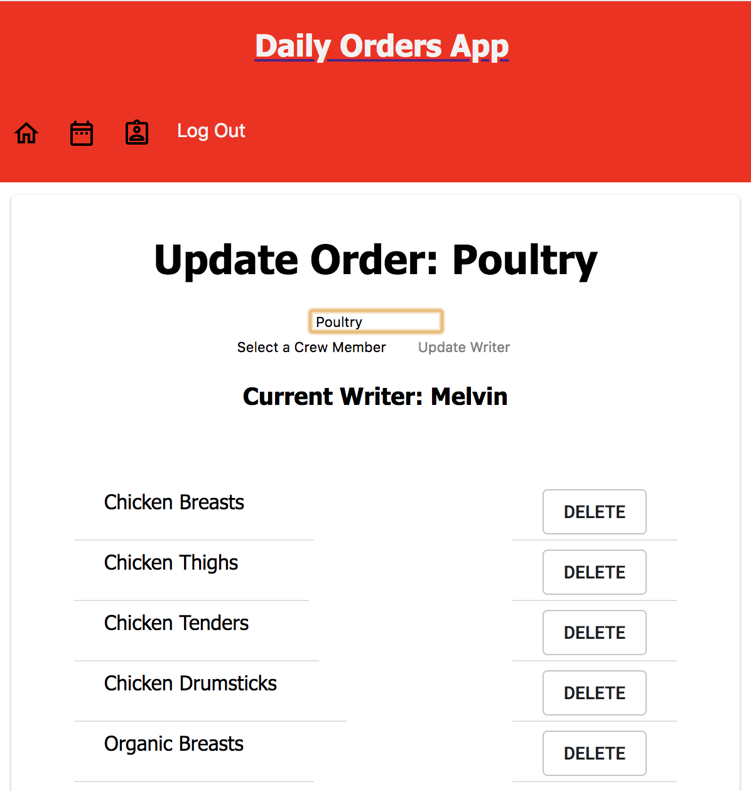

# Daily Orders App

## Prerequisites/Software Used

### Setup

- Node.js
- Postico
- Terminal
- React
- React-Redux

## Installing

- Download project
- `npm install`
- `createdb order_writer_app`
- `use database.sql to insert necessary tables to database.`
- `npm run server`
- `npm run client`

## Screen Shots

### 1 Log In Page

### 2 Crew Dashboard

### 3 Order Sheet

### 4 Past Order Sheet

### 5 History

### 6 Update Orders

### 7 Update Specific Order Top of Screen

### 8 Update Specific Order Bottom of Screen

## Documentation

- [Link to orginal assignment:](https://github.com/PrimeAcademy/redux-pizza-parlor)

## Completed Features

- Display a list of pizzas from the server via GET request.
- Add pizza to the cart/Remove pizza from cart.
- Created header component to display on every page. Conditionally renders the current cost of the cart depending on page.
- Page with a form to collect customer information.
- Created an admin page that displays order history from the server.

## Future Features

- More CSS and Material UI styling
- 

## Deployment

- Heroku: https://daily-orders-app.herokuapp.com/#/home

## Author

- Max Todd

## Acknowledge 

- I would like to thank Chris Black, my instructor at Prime, for all of his support. 
- I would additionally like to thank Kris Szfranski and Ally Boyd.
- Thanks to my cohort, Zaurak.

